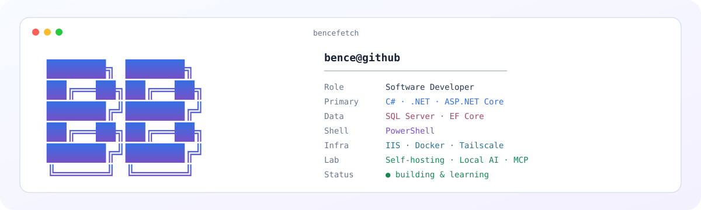

<picture>
  <source media="(prefers-color-scheme: dark)" srcset="./assets/hero-dark.svg">
  <source media="(prefers-color-scheme: light)" srcset="./assets/hero-light.svg">
  
</picture>

<div align="center">

[](https://itsmebencebudai.github.io/)
[](https://github.com/itsmebencebudai?tab=repositories)
[](https://github.com/itsmebencebudai/clast)

[](https://git.io/typing-svg)

</div>

---

## 01 / WHOAMI

I'm **Budai Bence**, a software developer based in **Budapest, Hungary**.

My main focus is **C# / .NET**, **ASP.NET Core**, backend systems, automation, and the infrastructure around the software I build. I like working across the full path from application code and APIs to deployment, networking, observability, and the tooling that makes the next iteration easier.

I also run my own homelab and use it as a practical environment for self-hosting, infrastructure experiments, automation, local AI, and developer tooling.

I'm currently studying at **Óbuda University — John von Neumann Faculty of Informatics**.

---

## 02 / TOOLKIT

| Area | Working with |
| --- | --- |
| **Backend** | `C#` · `.NET` · `ASP.NET Core` · `REST APIs` · `Entity Framework Core` |
| **Data** | `SQL Server` · relational data · migrations · queries |
| **Automation** | `PowerShell` · `GitHub Actions` · repeatable scripting |
| **Infrastructure** | `Windows Server` · `IIS` · `Docker` · `Tailscale` |
| **Web** | `HTML` · `CSS` · `JavaScript` |
| **Dev tooling** | `Git` · `GitHub` · `Visual Studio` · `VS Code` |
| **Lab** | self-hosting · local LLMs · coding agents · MCP · system integration |

<div align="center">


</div>

---

## 03 / FEATURED BUILDS

<table>
<tr>
<td width="50%" valign="top">

### ⚡ [CopyLast](https://github.com/itsmebencebudai/clast)

A small PowerShell tool that captures the previous command together with its visible output and copies it to the clipboard.

Built to make terminal-heavy development and AI-assisted workflows faster.

**PowerShell · Windows · Developer Tooling · MIT**

[View repository →](https://github.com/itsmebencebudai/clast)

</td>
<td width="50%" valign="top">

### 🌐 [Developer Portfolio](https://itsmebencebudai.github.io/)

My personal developer site with selected work, technologies, experiments, and additional background.

The site is deployed through GitHub Pages and acts as the longer-form counterpart to this profile.

**HTML · CSS · JavaScript · GitHub Pages**

[Visit portfolio →](https://itsmebencebudai.github.io/)

</td>
</tr>
</table>

> A lot of my current work is still in private repositories while it is being built and validated. I publish selected tools and projects once they are ready to stand on their own.

---

## 04 / SYSTEM MAP

I like thinking about software as a system rather than only an application.

<picture>
  <source media="(prefers-color-scheme: dark)" srcset="./assets/architecture-dark.svg">
  <source media="(prefers-color-scheme: light)" srcset="./assets/architecture-light.svg">
  
</picture>

---

## 05 / DEV LAB

<picture>
  <source media="(prefers-color-scheme: dark)" srcset="./assets/bencefetch-dark.svg">
  <source media="(prefers-color-scheme: light)" srcset="./assets/bencefetch-light.svg">
  
</picture>

My lab is where application development meets systems work:

- local inference and coding models
- AI-assisted development workflows
- MCP and tool integrations
- self-hosted services
- Windows and Linux infrastructure
- deployment and networking experiments
- small utilities that remove repetitive work

---

## 06 / CURRENT FOCUS

```text
current_focus/
├── aspnet-core-architecture
├── backend-apis
├── developer-automation
├── deployment-systems
├── local-ai
├── mcp-and-agents
└── open-source-tooling
```

The goal is usually the same: **build something useful, make it repeatable, document it, then improve the workflow around it.**

---

## 07 / LIVE SNAPSHOT

This card is generated by a script in this repository and refreshed by GitHub Actions.

<picture>
  <source media="(prefers-color-scheme: dark)" srcset="./assets/live-stats-dark.svg">
  <source media="(prefers-color-scheme: light)" srcset="./assets/live-stats-light.svg">
  
</picture>

<details>
<summary><strong>Contribution activity</strong></summary>
<br>

<picture>
  <source media="(prefers-color-scheme: dark)" srcset="https://raw.githubusercontent.com/itsmebencebudai/itsmebencebudai/output/github-contribution-grid-snake-dark.svg">
  <source media="(prefers-color-scheme: light)" srcset="https://raw.githubusercontent.com/itsmebencebudai/itsmebencebudai/output/github-contribution-grid-snake.svg">
  
</picture>

</details>

---

## 08 / HOW I LIKE TO BUILD

```text
design
  ↓
build
  ↓
validate
  ↓
deploy
  ↓
observe
  ↓
automate
  ↓
improve
```

I care about:

- clear architecture and boundaries
- reliable deployment
- sensible security defaults
- useful documentation
- repeatable automation
- observable systems
- tooling that makes future changes easier

---

## 09 / PROFILE AS CODE

This GitHub profile is intentionally built like a small project instead of being a static wall of badges.

```text
itsmebencebudai/
├── README.md
├── assets/
│   ├── hero-dark.svg
│   ├── hero-light.svg
│   ├── bencefetch-dark.svg
│   ├── bencefetch-light.svg
│   ├── architecture-dark.svg
│   ├── architecture-light.svg
│   ├── live-stats-dark.svg
│   └── live-stats-light.svg
├── data/
│   └── profile.json
├── scripts/
│   └── generate-stats.ps1
└── .github/
    └── workflows/
        ├── profile-stats.yml
        └── contribution-snake.yml
```

The core visual assets live in this repository. Dynamic statistics are generated locally by the workflow instead of relying on a third-party stats card service.

---

<div align="center">

### Build. Automate. Improve.

`C#` · `.NET` · `PowerShell` · `Infrastructure` · `Developer Tooling`

<br>

[Portfolio](https://itsmebencebudai.github.io/) ·
[Repositories](https://github.com/itsmebencebudai?tab=repositories) ·
[CopyLast](https://github.com/itsmebencebudai/clast)

<br><br>

<sub>~/bence ❯ _</sub>

</div>
