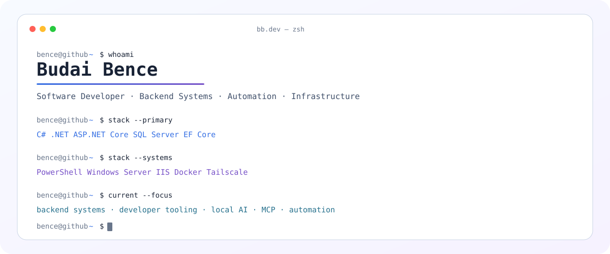
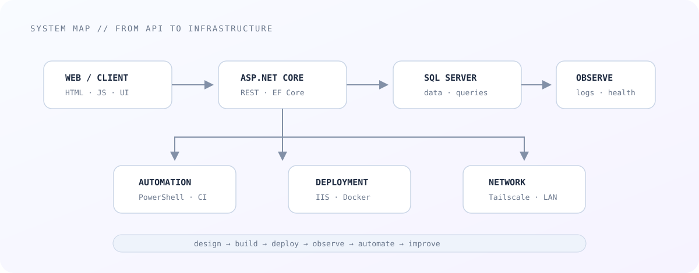
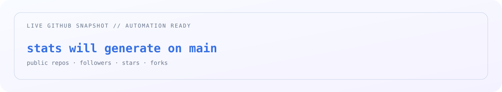

<picture>
  <source media="(prefers-color-scheme: dark)" srcset="./assets/concept-a-terminal-dark.svg">
  <source media="(prefers-color-scheme: light)" srcset="./assets/concept-a-terminal-light.svg">
  
</picture>

<div align="center">

[portfolio](https://itsmebencebudai.github.io/) ·
[projects](https://github.com/itsmebencebudai?tab=repositories) ·
[copylast](https://github.com/itsmebencebudai/clast)

</div>

---

## `$ cat about.txt`

```text
name      Budai Bence
location  Budapest, Hungary
role      Software Developer
focus     Backend Systems · Automation · Infrastructure

I build software across the full path from application code
to deployment, networking, automation, and developer tooling.
```

I primarily work with **C# / .NET and ASP.NET Core**, with **SQL Server** on the data side and **PowerShell, IIS, Docker, and Tailscale** around deployment and infrastructure.

Outside application development, I run a homelab where I experiment with self-hosting, local AI, MCP integrations, networking, and workflow automation.

Currently studying at **Óbuda University — John von Neumann Faculty of Informatics**.

---

## `$ tree ./stack`

```text
stack/
├── backend/
│   ├── C#
│   ├── .NET
│   ├── ASP.NET Core
│   ├── REST APIs
│   └── Entity Framework Core
│
├── data/
│   └── SQL Server
│
├── automation/
│   ├── PowerShell
│   └── GitHub Actions
│
├── infrastructure/
│   ├── Windows Server
│   ├── IIS
│   ├── Docker
│   └── Tailscale
│
└── lab/
    ├── self-hosting
    ├── local AI
    ├── coding agents
    └── MCP
```

---

## `$ ls ./projects`

<table>
<tr>
<td width="50%" valign="top">

### ⚡ [clast](https://github.com/itsmebencebudai/clast)

```text
type     developer tool
runtime  PowerShell
status   public
license  MIT
```

Copies the previous PowerShell command and its visible output directly to the clipboard.

Built for fast terminal-to-AI and terminal-to-document workflows.

[open repository →](https://github.com/itsmebencebudai/clast)

</td>
<td width="50%" valign="top">

### 🌐 [portfolio](https://itsmebencebudai.github.io/)

```text
type     developer site
stack    HTML / CSS / JS
deploy   GitHub Pages
status   public
```

Longer-form portfolio with projects, technologies, experiments, and background.

[open portfolio →](https://itsmebencebudai.github.io/)

</td>
</tr>
</table>

```text
note: a significant part of my current development work is still private
      while projects are being built, validated, and prepared for release.
```

---

## `$ ./system-map`

<picture>
  <source media="(prefers-color-scheme: dark)" srcset="./assets/architecture-dark.svg">
  <source media="(prefers-color-scheme: light)" srcset="./assets/architecture-light.svg">
  
</picture>

---

## `$ cat current-focus`

```text
[active]  aspnet-core-architecture
[active]  backend-apis
[active]  developer-automation
[active]  deployment-systems
[lab]     local-ai
[lab]     mcp-and-agents
[next]    open-source-tooling
```

---

## `$ github --snapshot`

<picture>
  <source media="(prefers-color-scheme: dark)" srcset="./assets/live-stats-dark.svg">
  <source media="(prefers-color-scheme: light)" srcset="./assets/live-stats-light.svg">
  
</picture>

<details>
<summary><code>$ github --contributions --animate</code></summary>
<br>

<picture>
  <source media="(prefers-color-scheme: dark)" srcset="https://raw.githubusercontent.com/itsmebencebudai/itsmebencebudai/output/github-contribution-grid-snake-dark.svg">
  <source media="(prefers-color-scheme: light)" srcset="https://raw.githubusercontent.com/itsmebencebudai/itsmebencebudai/output/github-contribution-grid-snake.svg">
  
</picture>

</details>

---

## `$ philosophy --short`

```text
design → build → validate → deploy → observe → automate → improve
```

I like software that is understandable, deployable, observable, documented, and easier to work on the second time than it was the first.

---

<div align="center">

`bence@github:~$ build --useful --repeatable` █

</div>
