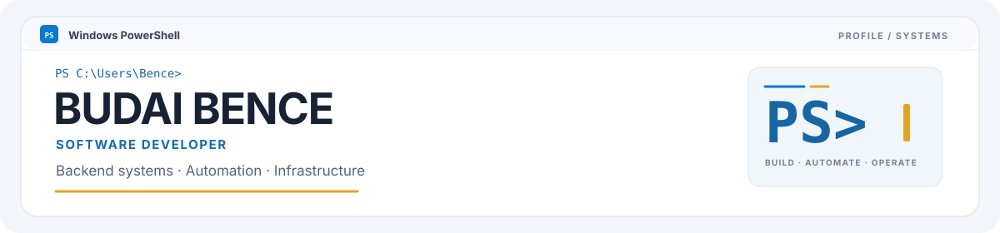

<div align="center">

<picture>
  <source media="(prefers-color-scheme: dark)" srcset="./assets/hero-dark.svg">
  <source media="(prefers-color-scheme: light)" srcset="./assets/hero-light.svg">
  
</picture>

[**Portfolio**](https://itsmebencebudai.github.io/) · [**All repositories**](https://github.com/itsmebencebudai?tab=repositories)

</div>

```powershell
PS> Get-Content .\data\profile.json -Raw | ConvertFrom-Json |
>> Format-List role,location

role     : Software Developer
location : Budapest, Hungary
```

I’m studying Computer Science Engineering (BProf) at **Óbuda University — John von Neumann Faculty of Informatics**. I like building across the whole path: application architecture, APIs and data, deployment, operations, and the automation that ties them together.

## Focus & stack

### Applications & data

[](https://learn.microsoft.com/dotnet/csharp/) [](https://dotnet.microsoft.com/) [](https://learn.microsoft.com/sql/sql-server/)

ASP.NET Core · Entity Framework Core · REST APIs

### Automation

[](https://learn.microsoft.com/powershell/) [](https://docs.github.com/actions)

PowerShell tooling · repeatable delivery workflows

### Windows & infrastructure

[](https://docs.docker.com/) [](https://tailscale.com/kb/)

Windows Server · IIS · self-hosted systems

## Selected work

### [CopyLast](https://github.com/itsmebencebudai/clast)

A PowerShell 7 utility that recovers the previous command and its visible output from the current session transcript. Preview it, copy it, or reset the transcript.

`PowerShell 7` · `Windows` · `MIT`

### [Developer portfolio](https://itsmebencebudai.github.io/)

My personal site for selected projects, experiments, and technical background. Built with HTML, CSS, and JavaScript.

## In the lab

I explore self-hosted infrastructure, local AI, coding agents, and MCP integrations, looking for practical ways to improve development and operations workflows.
