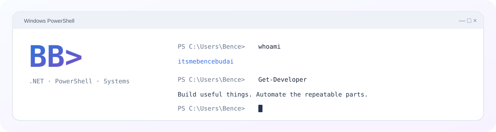
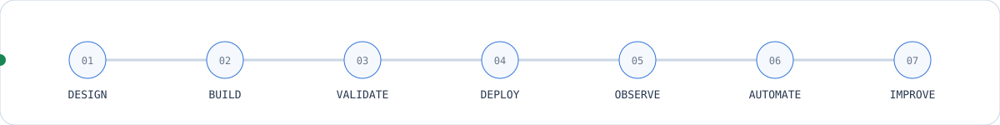

<picture>
  <source media="(prefers-color-scheme: dark)" srcset="./assets/c4-workstation-dark.svg">
  <source media="(prefers-color-scheme: light)" srcset="./assets/c4-workstation-light.svg">
  
</picture>

[**portfolio**](https://itsmebencebudai.github.io/) ·
[**projects**](https://github.com/itsmebencebudai?tab=repositories) ·
[**copylast**](https://github.com/itsmebencebudai/clast)

  

---

## `Dev:\ > Get-Dashboard`

| **PROFILE** | **ACTIVE SESSION** |
| --- | --- |
| **Budai Bence** — software developer based in Budapest, Hungary.  Primary focus: **C# / .NET / ASP.NET Core** with the systems around the application: automation, infrastructure, deployment, networking, and developer tooling.  Studying at **Óbuda University — John von Neumann Faculty of Informatics**. |      |

---

## `Dev:\ > Get-Stack`

  
  &nbsp;&nbsp;
  
  &nbsp;&nbsp;
  
  &nbsp;&nbsp;
  
  &nbsp;&nbsp;
  
  &nbsp;&nbsp;
  
  &nbsp;&nbsp;
  
  &nbsp;&nbsp;
  
  &nbsp;&nbsp;
  
  &nbsp;&nbsp;
  

| **APPLICATION** | **SYSTEMS & AUTOMATION** | **DEVELOPMENT & LAB** |
| --- | --- | --- |
|  **Backend** `C#` · `.NET` `ASP.NET Core` `REST APIs` · `EF Core`   **Data** `SQL Server` · `migrations` `relational data` · `queries` |  **Automation** `PowerShell` · `GitHub Actions` `repeatable scripting`   **Infrastructure** `Windows Server` · `IIS` `Docker` · `Tailscale` |  **Tooling** `Git` · `GitHub` `Visual Studio` · `VS Code`   **Web / Lab** `HTML` · `CSS` · `JavaScript` `self-hosting` · `local AI` · `MCP` |

---

## `Dev:\ > Get-Projects`

|  **[CopyLast](https://github.com/itsmebencebudai/clast)** |  **[Developer Portfolio](https://itsmebencebudai.github.io/)** |
| --- | --- |
| PowerShell utility that copies the previous command together with its visible output directly to the clipboard.  Built for terminal-heavy development, troubleshooting, documentation, and AI-assisted workflows.     | Longer-form developer portfolio with selected projects, technologies, experiments, and background.  Deployed with GitHub Pages and built with HTML, CSS, and JavaScript.    |

> A significant amount of my current development work remains private while projects are being built, validated, and prepared for release.

---

## `Dev:\ > Get-Lab`

| **INFRASTRUCTURE** | **AUTOMATION** | **AI & TOOLING** |
| --- | --- | --- |
| `Windows Server` `Docker` `Networking` `Self-hosting` | `PowerShell` `GitHub Actions` `Deployment` `Recovery` | `Local LLMs` `Coding Agents` `MCP` `System Integration` |

The lab is where I test more than application code: how software is **deployed, connected, automated, observed, and recovered**.

---

## `Dev:\ > Get-BuildPipeline`

<picture>
  <source media="(prefers-color-scheme: dark)" srcset="./assets/c4-pipeline-dark.svg">
  <source media="(prefers-color-scheme: light)" srcset="./assets/c4-pipeline-light.svg">
  
</picture>

**Build something useful. Make it repeatable. Document it. Improve the workflow around it.**

---

## `Dev:\ > Get-GitHubActivity`

<picture>
  <source media="(prefers-color-scheme: dark)" srcset="https://raw.githubusercontent.com/itsmebencebudai/itsmebencebudai/output/github-contribution-grid-snake-dark.svg">
  <source media="(prefers-color-scheme: light)" srcset="https://raw.githubusercontent.com/itsmebencebudai/itsmebencebudai/output/github-contribution-grid-snake.svg">
  
</picture>

---

`Dev:\ > Build-UsefulThing -Repeatable` █

