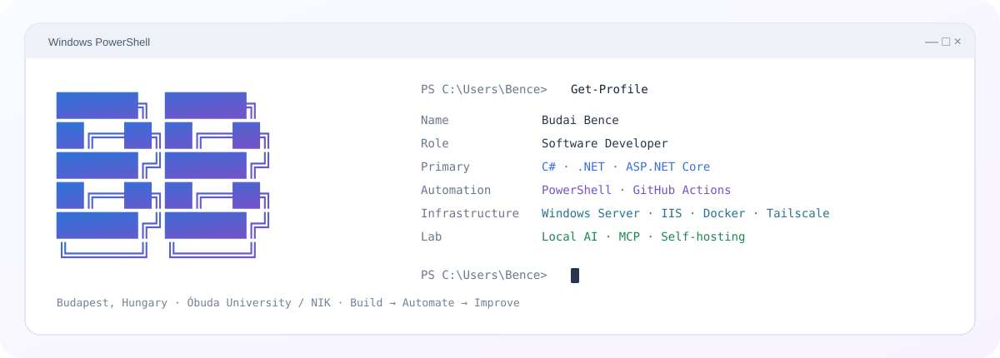
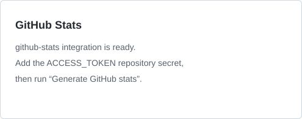
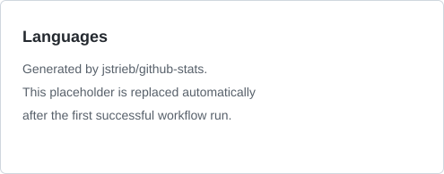

<picture>
  <source media="(prefers-color-scheme: dark)" srcset="./assets/c3-powershell-dark.svg">
  <source media="(prefers-color-scheme: light)" srcset="./assets/c3-powershell-light.svg">
  
</picture>

<div align="center">

[**portfolio**](https://itsmebencebudai.github.io/) ·
[**projects**](https://github.com/itsmebencebudai?tab=repositories) ·
[**copylast**](https://github.com/itsmebencebudai/clast)

</div>

---

## `PS C:\Users\Bence> Get-Profile`

I'm **Budai Bence**, a software developer based in **Budapest, Hungary**.

My main stack is **C# / .NET and ASP.NET Core**, with a strong interest in the systems around the application: **SQL Server, PowerShell automation, Windows Server, IIS, Docker, networking, deployment, and developer tooling**.

I also maintain a homelab where I experiment with **self-hosting, local AI, coding agents, MCP integrations, and infrastructure automation**.

Currently studying at **Óbuda University — John von Neumann Faculty of Informatics**.

---

## `PS C:\Users\Bence> Get-Stack | Format-Table`

| Area | Technologies |
| --- | --- |
| **Backend** | C# · .NET · ASP.NET Core · REST APIs · Entity Framework Core |
| **Data** | SQL Server · relational data · migrations · queries |
| **Automation** | PowerShell · GitHub Actions · repeatable scripting |
| **Infrastructure** | Windows Server · IIS · Docker · Tailscale |
| **Web** | HTML · CSS · JavaScript |
| **Development** | Git · GitHub · Visual Studio · VS Code |
| **Lab** | self-hosting · local AI · coding agents · MCP · system integration |

---

## `PS C:\Users\Bence\Projects> Get-ChildItem`

### ⚡ [CopyLast](https://github.com/itsmebencebudai/clast)

A small PowerShell utility that copies the previous command together with its visible output directly to the clipboard.

Built for terminal-heavy development, troubleshooting, documentation, and AI-assisted workflows.

```powershell
Name        : clast
Type        : Developer Tool
Runtime     : PowerShell
Status      : Online
License     : MIT
```

### 🌐 [Developer Portfolio](https://itsmebencebudai.github.io/)

My longer-form developer portfolio with selected projects, technologies, experiments, and background.

```powershell
Name        : Portfolio
Type        : Developer Site
Deployment  : GitHub Pages
Status      : Online
Stack       : HTML / CSS / JavaScript
```

> A significant amount of my current development work remains private while projects are being built, validated, and prepared for release.

---

## `PS C:\Users\Bence> Get-CurrentFocus`

```text
State      Focus
-----      -----
RUNNING    ASP.NET Core architecture
RUNNING    Backend APIs
RUNNING    Developer automation
RUNNING    Deployment systems
LAB        Local AI
LAB        MCP and coding agents
NEXT       Open-source tooling
```

---

## `PS C:\Lab> Get-ChildItem -Directory`

```text
C:\Lab
├── SelfHostedServices
├── WindowsInfrastructure
├── Docker
├── Networking
├── LocalAI
├── CodingAgents
├── MCP
└── PowerShellAutomation
```

The lab gives me a practical place to test more than application code: how software is **deployed, connected, automated, observed, and recovered**.

---

## `PS C:\Users\Bence> Get-BuildProcess`

```text
Design
  ↓
Build
  ↓
Validate
  ↓
Deploy
  ↓
Observe
  ↓
Automate
  ↓
Improve
  ↺
```

**Build something useful. Make it repeatable. Document it. Improve the workflow around it.**

---

## `PS C:\Users\Bence> Get-GitHubStats`

<div align="center">




<sub>Generated with <a href="https://github.com/jstrieb/github-stats">jstrieb/github-stats</a>.</sub>

</div>

These cards are generated inside this repository by GitHub Actions. The workflow can include statistics from private repositories once the required GitHub token is configured, while the profile itself remains public.

<details>
<summary><code>PS C:\Users\Bence> Show-ContributionActivity</code></summary>

<br>

<picture>
  <source media="(prefers-color-scheme: dark)" srcset="https://raw.githubusercontent.com/itsmebencebudai/itsmebencebudai/output/github-contribution-grid-snake-dark.svg">
  <source media="(prefers-color-scheme: light)" srcset="https://raw.githubusercontent.com/itsmebencebudai/itsmebencebudai/output/github-contribution-grid-snake.svg">
  
</picture>

</details>

---

<div align="center">

`PS C:\Users\Bence> Build-UsefulThing -Repeatable` <sub>█</sub>

</div>
