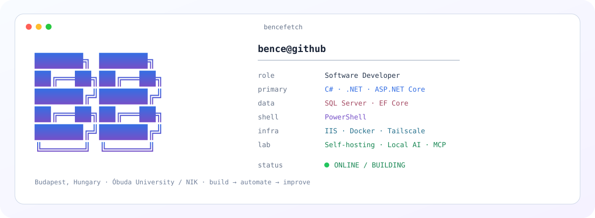
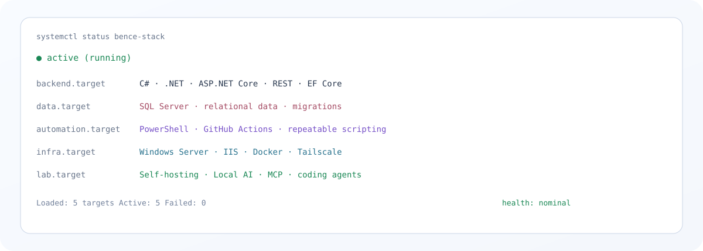
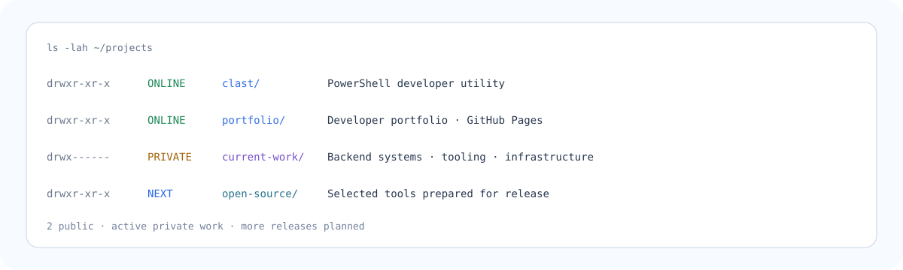

<picture>
  <source media="(prefers-color-scheme: dark)" srcset="./assets/c2-header-dark.svg">
  <source media="(prefers-color-scheme: light)" srcset="./assets/c2-header-light.svg">
  
</picture>

<div align="center">

[**portfolio**](https://itsmebencebudai.github.io/) ·
[**projects**](https://github.com/itsmebencebudai?tab=repositories) ·
[**copylast**](https://github.com/itsmebencebudai/clast)

</div>

---

## `$ systemctl status bence-stack`

<picture>
  <source media="(prefers-color-scheme: dark)" srcset="./assets/c2-systems-dark.svg">
  <source media="(prefers-color-scheme: light)" srcset="./assets/c2-systems-light.svg">
  
</picture>

---

## `$ cat /etc/profile.d/about.conf`

```ini
NAME="Budai Bence"
ROLE="Software Developer"
LOCATION="Budapest, Hungary"
FOCUS="Backend Systems / Automation / Infrastructure"
STUDY="Óbuda University / John von Neumann Faculty of Informatics"
```

I build software across the entire path from **application code and APIs** to **data, deployment, networking, automation, and developer tooling**.

The part I enjoy most is connecting those layers so the system is easier to understand, deploy, operate, and improve.

---

## `$ ls -lah ~/projects`

<picture>
  <source media="(prefers-color-scheme: dark)" srcset="./assets/c2-projects-dark.svg">
  <source media="(prefers-color-scheme: light)" srcset="./assets/c2-projects-light.svg">
  
</picture>

<table>
<tr>
<td width="50%" valign="top">

### ⚡ [clast](https://github.com/itsmebencebudai/clast)

PowerShell utility that copies the previous command together with its visible output.

```text
state    ONLINE
type     developer-tool
runtime  PowerShell
license  MIT
```

</td>
<td width="50%" valign="top">

### 🌐 [portfolio](https://itsmebencebudai.github.io/)

Longer-form developer portfolio with selected projects, technologies, and experiments.

```text
state    ONLINE
type     developer-site
deploy   GitHub Pages
stack    HTML / CSS / JS
```

</td>
</tr>
</table>

---

## `$ ps aux | grep current-focus`

```text
PID   STATE     PROCESS
101   RUNNING   aspnet-core-architecture
102   RUNNING   backend-apis
103   RUNNING   developer-automation
104   RUNNING   deployment-systems
201   LAB       local-ai
202   LAB       mcp-and-agents
301   NEXT      open-source-tooling
```

---

## `$ cat ~/lab/README`

My homelab is where application development meets systems work.

```text
lab/
├── self-hosted-services/
├── windows-and-linux-infrastructure/
├── docker-and-networking/
├── local-llm-inference/
├── coding-agents/
├── mcp-integrations/
└── powershell-automation/
```

It gives me a place to test ideas beyond the application itself: how software is hosted, connected, automated, monitored, and recovered.

---

## `$ ./build-process --show`

```text
design
  │
  ▼
build
  │
  ▼
validate
  │
  ▼
deploy
  │
  ▼
observe
  │
  ▼
automate
  │
  ▼
improve
  └──────────────► repeat
```

> Build something useful. Make it repeatable. Document it. Improve the workflow around it.

---

## `$ github --snapshot`

<picture>
  <source media="(prefers-color-scheme: dark)" srcset="./assets/live-stats-dark.svg">
  <source media="(prefers-color-scheme: light)" srcset="./assets/live-stats-light.svg">
  
</picture>

<details>
<summary><code>$ github --contributions --animate</code></summary>

<br>

<picture>
  <source media="(prefers-color-scheme: dark)" srcset="https://raw.githubusercontent.com/itsmebencebudai/itsmebencebudai/output/github-contribution-grid-snake-dark.svg">
  <source media="(prefers-color-scheme: light)" srcset="https://raw.githubusercontent.com/itsmebencebudai/itsmebencebudai/output/github-contribution-grid-snake.svg">
  
</picture>

</details>

---

<div align="center">

`bence@github:~$ build --useful --repeatable` <sub>█</sub>

</div>
