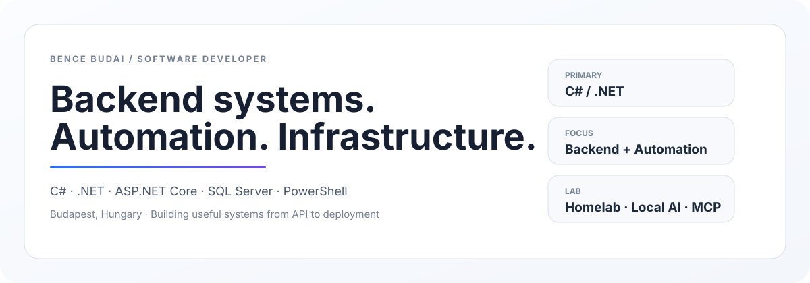

[← Style Lab](../STYLE-LAB.md)

[A · Terminal](./A-TERMINAL.md) · **B · Premium** · [C · Homelab](./C-HOMELAB.md) · [D · Product](./D-PRODUCT.md) · [E · Experimental](./E-EXPERIMENTAL.md)

---
<picture>
  <source media="(prefers-color-scheme: dark)" srcset="../assets/concept-b-premium-dark.svg">
  <source media="(prefers-color-scheme: light)" srcset="../assets/concept-b-premium-light.svg">
  
</picture>

### About

I’m **Budai Bence**, a software developer focused on **C# / .NET**, backend systems, automation, and the infrastructure that supports them.

I like building software with clear architecture, reliable deployment, useful tooling, and sensible operational boundaries.

### Toolkit

| Backend | Systems | Automation |
| --- | --- | --- |
| C# | Windows Server | PowerShell |
| .NET | IIS | GitHub Actions |
| ASP.NET Core | Docker | repeatable scripting |
| SQL Server | Tailscale | deployment workflows |

### Selected work

<table>
<tr>
<td width="50%" valign="top">

#### CopyLast
Small PowerShell developer tool that copies the previous command and its visible output.

[Repository →](https://github.com/itsmebencebudai/clast)

</td>
<td width="50%" valign="top">

#### Developer Portfolio
Longer-form portfolio with projects, technologies, experiments, and background.

[Portfolio →](https://itsmebencebudai.github.io/)

</td>
</tr>
</table>

### Current focus

**Backend architecture** · **developer automation** · **deployment systems** · **local AI** · **MCP** · **open-source tooling**

<picture>
  <source media="(prefers-color-scheme: dark)" srcset="../assets/live-stats-dark.svg">
  <source media="(prefers-color-scheme: light)" srcset="../assets/live-stats-light.svg">
  
</picture>
