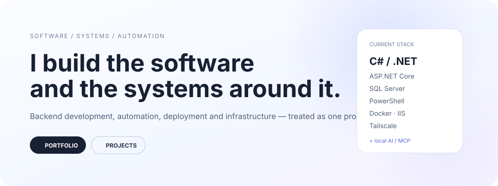

[← Style Lab](../STYLE-LAB.md)

[A · Terminal](./A-TERMINAL.md) · [B · Premium](./B-PREMIUM.md) · [C · Homelab](./C-HOMELAB.md) · **D · Product** · [E · Experimental](./E-EXPERIMENTAL.md)

---
<picture>
  <source media="(prefers-color-scheme: dark)" srcset="../assets/concept-d-product-dark.svg">
  <source media="(prefers-color-scheme: light)" srcset="../assets/concept-d-product-light.svg">
  
</picture>

[**Portfolio**](https://itsmebencebudai.github.io/) ·
[**Projects**](https://github.com/itsmebencebudai?tab=repositories) ·
[**CopyLast**](https://github.com/itsmebencebudai/clast)

## Building software as a whole system

I work primarily with **C# / .NET and ASP.NET Core**, but I’m most interested in the entire lifecycle around the application: APIs, data, automation, deployment, infrastructure, and developer experience.

### What I build around

<table>
<tr>
<td width="33%" valign="top">

#### Backend
C#  
.NET  
ASP.NET Core  
REST APIs  
Entity Framework Core

</td>
<td width="33%" valign="top">

#### Delivery
PowerShell  
GitHub Actions  
IIS  
Docker  
deployment automation

</td>
<td width="33%" valign="top">

#### Systems
SQL Server  
Windows Server  
Tailscale  
self-hosting  
local AI / MCP

</td>
</tr>
</table>

## Selected work

### CopyLast
A focused PowerShell utility for terminal-heavy workflows.

### Personal portfolio
A longer-form view of my projects, skills, and experiments.

## Development philosophy

> Build the application, understand the system around it, automate the repetitive parts, and leave the next iteration easier than the first.

<picture>
  <source media="(prefers-color-scheme: dark)" srcset="../assets/live-stats-dark.svg">
  <source media="(prefers-color-scheme: light)" srcset="../assets/live-stats-light.svg">
  
</picture>
