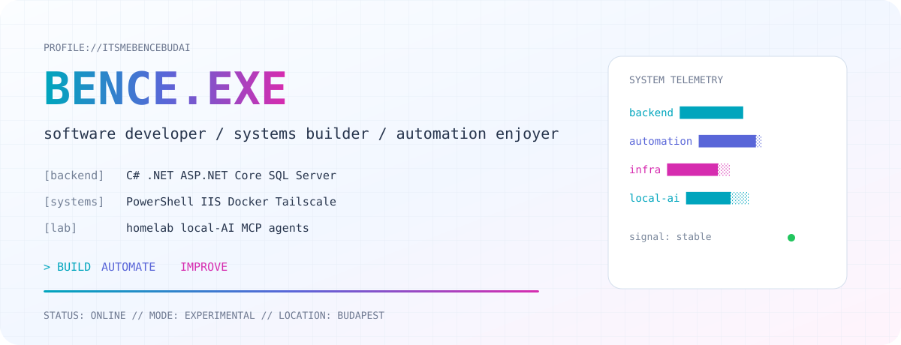

[← Style Lab](../STYLE-LAB.md)

[A · Terminal](./A-TERMINAL.md) · [B · Premium](./B-PREMIUM.md) · [C · Homelab](./C-HOMELAB.md) · [D · Product](./D-PRODUCT.md) · **E · Experimental**

---
<picture>
  <source media="(prefers-color-scheme: dark)" srcset="../assets/concept-e-experimental-dark.svg">
  <source media="(prefers-color-scheme: light)" srcset="../assets/concept-e-experimental-light.svg">
  
</picture>

## SYSTEM://PROFILE

~~~yaml
identity:
  name: Budai Bence
  role: Software Developer

runtime:
  backend: [C#, .NET, ASP.NET Core]
  data: [SQL Server, EF Core]
  automation: [PowerShell, GitHub Actions]
  infrastructure: [Windows Server, IIS, Docker, Tailscale]

experimental:
  - local AI
  - coding agents
  - MCP
  - self-hosting
~~~

## MODULES://PUBLIC

| Module | State | Type |
| --- | --- | --- |
| **CopyLast** | ONLINE | PowerShell tooling |
| **Portfolio** | ONLINE | GitHub Pages |
| **More** | BUILDING | selected future releases |

## ACTIVITY://STREAM

<picture>
  <source media="(prefers-color-scheme: dark)" srcset="https://raw.githubusercontent.com/itsmebencebudai/itsmebencebudai/output/github-contribution-grid-snake-dark.svg">
  <source media="(prefers-color-scheme: light)" srcset="https://raw.githubusercontent.com/itsmebencebudai/itsmebencebudai/output/github-contribution-grid-snake.svg">
  
</picture>

<code>BUILD://AUTOMATE://IMPROVE</code>

